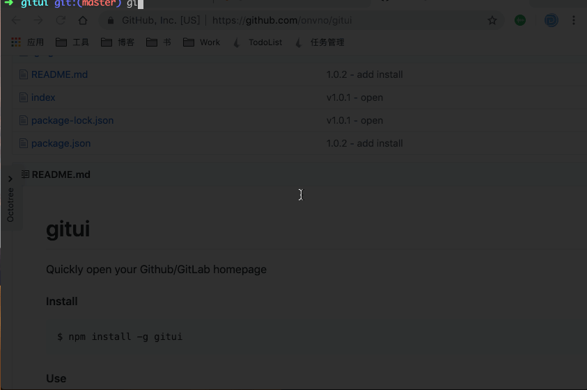

# gitui

Quickly open your Github/GitLab homepage

#### Install
```
$ npm install -g gituaja
```


#### Use

```
$ cd repo/dir/path
$ gituaja

# 打开gitlab,方便项目merge使用
$ gituaja merge
```


#### GiF

